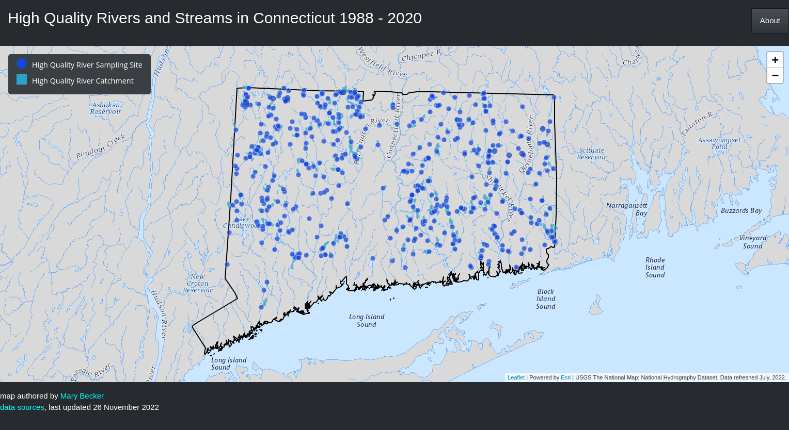
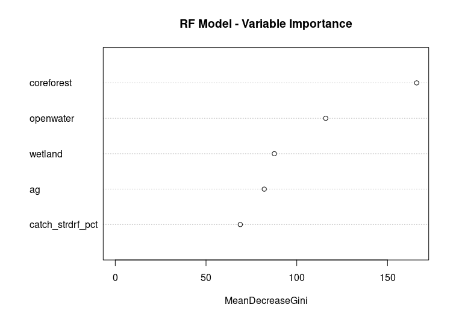
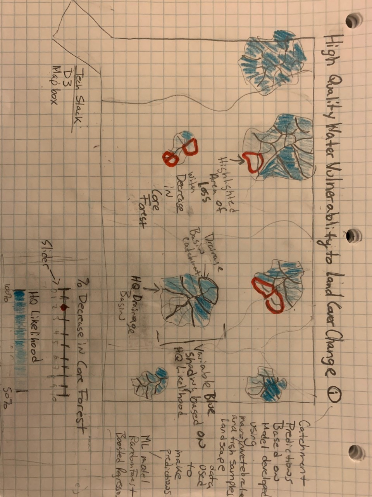

# Enhancing U.S. Clean Water Act Implementation - A Framework to Inform High Quality Stream Protection

*Submitted to the faculty of University of Kentucky, Lexington Kentucky, in partial fulfillment of the requirements for the degree of Master of Science in the department of Geography Digital Mapping program*

[**Interactive Map – Ver. 0.8 2022-11-26**](https://marybecker.github.io/HQStreamEval/index.html)

[**Defense Presentation - 2022-11-29**](https://marybecker.github.io/HQStreamEval/presentation/index.html)

## I. Introduction and Overview
Significant progress has been made to clean up rivers since the passage of the 1972 U.S. Federal Water Pollution and Control Act amendments, more commonly referred to as the Clean Water Act (CWA). However, since that time much of the focus has been on restoring waste-receiving streams with overt pollution problems which has left high quality streams vulnerable and open to degradation (EPA 2012a). High quality streams are those waters whose quality exceed that necessary to protect the minimum goals, typically referred to as “fishable / swimmable”, under the CWA.  High quality streams support healthy populations of aquatic life only found under least disturbed conditions with little pollution (Bellucci et al. 2011) along with a wide array of critical ecosystem services that benefit the social and economic well-being of humans (EPA 2012b).   Despite restoration efforts, studies around the U.S. have noted that aquatic ecosystems are continuing to decline and pollutants levels are increasing in pristine streams (EPA 2012a, Hudy et al. 2011, Stoddard et al. 2016).  Preliminary work conducted in Connecticut suggests the possible reduction of species sensitive to pollution in some high-quality streams sampling sites monitored over the past 30 years (Eltz & Beauchene 2020, Becker & Bellucci 2021).

The Section 101(a) objective of the CWA is “…to restore and maintain the chemical, physical and biological integrity of the Nation’s waters.”  The Committee Report in support of the 1972 amendments clarified that the term integrity “…refers to a condition in which the natural structure and function of ecosystems is maintained,” rather than purely focusing on the restoration of impaired waters (U.S. Government Printing Office 1972, Doppelt et al. 1993).   This project utilizes modernized landscape level assessment methods that continue to augment the success of the CWA by including a focus on conservation and protection of rivers and streams.  This is accomplished by incorporating the concept of the biological condition gradient.  A demonstration of this method is applied in the State of Connecticut.

The Biological Condition Gradient (BCG) is a scientific framework to uniformly and directly interpret biological responses to anthropogenic stress (Davies & Jackson, 2006).  Biological integrity is the ability of an aquatic ecosystem to support and maintain a balanced, adaptive community of organisms having a species composition, diversity, and functional organization comparable to that of natural habitats within a region. The presence, condition, numbers and types of fish, insects, algae, plants, and other organisms provide direct information about the health of aquatic life in water bodies. Biological assessments measure these factors and are the primary tool used to evaluate the condition of water bodies. Because biological communities are affected by all of the stressors to which they are exposed over time, bioassessments provide information on disturbances not always revealed by water chemistry or other measurements.

The BCG framework provides a way to designate refined aquatic life uses along a gradient of stress.  This allows for a more precise measure of biological condition rather than one that focuses on a minimally acceptable goal (e.g. ‘pass’/’fail’ system) that has been previously used for biological assessments (EPA 2012).  The BCG is a universal measurement system that is calibrated on a common scale for all states and regions.  There are 6 levels of biological condition described by the framework (Figure 1).  The levels are described in terms of changes in the structure and function of native aquatic communities. The levels range from a natural pristine condition with little anthropogenic stress (Level 1) to a severely stressed and altered condition that exhibits extreme changes in structure and ecosystem function (Level 6).

*Figure 1. Biological Condition Gradient Conceptual Model.  High quality streams are defined as BCG 1 and 2.  Polluted streams are defined as BCG 5 & 6.*

Using biological data sets collected over the past 30 years I used the BCG to identify high quality streams in Connecticut. I then calculated landscape attributes in the drainage basins and catchments that support high quality stream conditions. Finally, I developed a model using these landscape characteristics to predict the likelihood of stream catchments supporting high quality conditions where samples have not been collected. These predictions are used to identify those high-quality streams that are most vulnerable to degradation if human disturbance is increased in those catchments.

This information could be used by aquatic resource managers, decision makers and the public to prioritize preservation efforts, as well as support management to prevent further degradation in these streams and implement anti-degradation measures under the Clean Water Act.   The interactive web-mapping application was developed to convey this data on high quality streams and drainage systems to decision makers. The application provides a simplified high-level overview of statewide conditions, while still allowing the user to dig deeper into the catchment and drainage basin scale data through leveled zoom and click functions with popup information. The application displays the probability of a stream catchment supporting high quality conditions. A slider changes the the amount of core forest reduction in the upstream drainage basin from current conditions resulting in updated predictions on the map. This allows for a 'what if' analysis that identifies those catchments that are most vulnerable to small increases in disturbance.

## II. Modeling Methodology and Results
### A. Data and general modeling approach

**General Modeling Approach**

To develop models that make stream-specific prediction across Connecticut, I used macro-invertebrate and fish biological data sets collected over the past 30 years by the CT DEEP Monitoring and Assessment Program, as well as, the Inland Fisheries Program.  I also used a high resolution National Hydrography flowline and catchment data set that was developed by the [USGS Conte Lab]( http://conte-ecology.github.io/shedsGisData/) and cleaned for Connecticut. This data set is based on a network of stream segments.  The stream network was used to calculate drainage basin land cover statistics using a [custom script in R](https://github.com/marybecker/HQStreamEval/blob/main/analysis/accum_attributes_V2.R).

The model was developed in several steps:
1.	Identify minimally disturbed streams that support high quality conditions and biological integrity (BCG Tiers 1 or 2) to create training and validation biological data sets
2.	Characterize temporally and spatially specific drainage basin environments for each biological sample that includes corresponding land cover conditions for the nearest time period of sampling using the [UCONN CLEAR](https://clear.uconn.edu/projects/landscape/) and [CT DEEP](https://ct-deep-gis-open-data-website-ctdeep.hub.arcgis.com/) 30 M resolution land cover data sets that describe natural and human disturbance conditions.
3.	Relate observed BCG to environmental predictors using a machine learning technique (e.g. random forests).
4.	Assess model performance and validate using multiple observations made at randomly chosen stream segments.

**Biological Data Sets and Biological Condition Gradient Metric Calculations**

Fish samples were collected by the CT DEEP Inland Fisheries and Ambient Monitoring and Assessment program using comparable methods during a May - October index period from 1988 – 2020 (Hagstrom et al. 1996, CT DEEP 2013). Crews sampled 10-20 mean stream widths with the average sample width being approximately 118 meters. Reach widths used in this data set ranged from 25 to 500 meters. The type of gear that a crew used depended on the stream width. In small streams, crews typically sample with one backpack shocker. In medium-sized streams, they used 2 backpack shockers or 1 tote barge, and in large streams, crews sampled with multi-tote barges. All captured individuals were measured to the nearest centimeter and are identified to the species level.

Benthic macro-invertebrate samples were collected by the CT DEEP Ambient Monitoring and Assessment program from September through November using an 800-u m-mesh kick net from 1989 - 2020. A total of 2 meters squared of riffle habitat (12 kicks composited from multiple riffles of a stream reach) were sampled at each location. Samples were preserved in 70% ethyl alcohol and brought back to the laboratory for subsampling. A 200-organism subsample was taken using a random grid design (Plafkin et al. 1989) from each sampling location. Organisms were identified to the lowest practical taxon, generally species.

Biological condition gradient models have been developed for both macro-invertebrate and fish communities in Connecticut (Gerritsen & Jessup 2007, Stamp & Gerritsen 2013).  The models incorporate multiple attribute decision criteria to assign stream to levels or tiers of the BCG and it can be directly applied to designation of multiple aquatic life uses in Connecticut’s water quality criteria and standards.  The models were run using the [BioMonTools](https://github.com/leppott/BioMonTools) and [BCGcalc](https://github.com/leppott/BCGcalc) packages written for the R statistical programming language (Leppo 2022a, Leppo 2022b).

*Figure 2. [BCG 1 and 2 Biological Sampling Sites 1988 - 2020 Interactive Map](https://marybecker.github.io/HighQualityStreams/)*

The final data set used for modeling included 5169 samples collected within 1769 individual stream segments.  This included 3244 fish samples and 1925 macro-invertebrate samples.  425 stream segments (~24%) contained a high quality sample (BCG 1 or 2) (Figure 2).

**Characterization of temporally and spatially specific drainage basin conditions for biological samples**

| Variable | Scale |Data resolution (m) | Source      |
| ---------- | -------|----------------------   |-------------|
| Core Forest 1985 - 2015| Drainage Basin |30 | UCONN CLEAR |
| Fragmented Forest 1985 - 2015| Drainage Basin |30 | UCONN CLEAR |
| Open Water 1985 - 2015| Drainage Basin |30 | UCONN CLEAR |
| Wetland 1985 - 2015| Drainage Basin |30 | UCONN CLEAR |
| Developed 1985 - 2015| Drainage Basin |30 | UCONN CLEAR |
| Agriculture 1985 - 2015| Drainage Basin |30 | UCONN CLEAR |
| Stratified Drift | Riparian |30 | CT DEEP     |
| Road Density | Drainage Basin |30 | CT DEEP     |
| Slope | Riparian |30 | CT DEEP     |

*Table 1. Landscape data used to predict high quality conditions in stream segments across Connecticut*

I derived 9 predictors (Table 1) previously identified to effect sensitive biological populations in Connecticut (Bellucci et al. 2013,  Kanno et al. 2015).  These predictors focused on characterizing the spatial variation in naturally occurring and human disturbance regimes across Connecticut streams. [Landcover datasets](https://clear.uconn.edu/projects/landscape/index.htm) developed by the University of Connecticut Center for Land Use and Education and Research (UCONN CLEAR) for 7 different time periods (1985, 1990, 1995, 2002, 2006, 2010 and 2015).  They were used to derived percentages of land cover classes and forest fragmentation.  I first [developed a script](https://github.com/marybecker/HQStreamEval/blob/main/analysis/lc_catchment_stats.R) to reclassify each land cover category needed for the model and then extracted land cover classes for each NHD stream catchment.  Once the land cover data set was reclassified I calculated zonal statistics for each catchment polygon using the [terra package in R](https://cran.rstudio.com/web/packages/terra/terra.pdf) (Hijams 2021).  Next I calculated the cumulative upstream drainage basin land cover percentages using a [custom developed R script](https://github.com/marybecker/HQStreamEval/blob/main/analysis/accum_attributes_V2.R). I then developed a R script to extract the temporally and spatially specific observations for each land cover class that matched the [closest time and location (stream segment) of each biological observation](https://github.com/marybecker/HQStreamEval/blob/main/analysis/bio_closest_lc_yr.R).  In addition, I characterized geological and hydrological conditions, such as stratified drift, stream density, and upstream drainage basin area.

**Random Forest Model Development to Relate Observed High Quality Conditions to Predictors**

I developed a random forest model to predict the occurrence of high quality conditions in Connecticut streams.  Random Forest (RF) is a regression and classification modeling approach that has been widely used in ecological modeling (Cutler et al. 2007, Valavi et al. 2021).  RF models combine predictions from many trees based on bootstrapped samples of predictor and response data to produce robust models resistant to overfitting.  Model accuracy was assessed by randomly reserving 20 percent of the samples for cross-validation testing.  [Models were built with the “randomForests” package in R](https://github.com/marybecker/HQStreamEval/blob/main/analysis/rf.R) (Liaw & Wiener 2002).  Multiple models were developed by adding and removing variables.  The best performing model with the highest and most consistent performing accuracy was chosen to use in the mapping application.  In all models core forest in the upstream drainage basin was the most important in explaining high quality conditions (Figure 2).

*Figure 3. Random Forest Variable Importance.  Predictors in the final model included percent core forest (coreforest), percent open water (openwater), percent wetland (wetland), percent agriculture (ag) and percent stratified drift (catch_strdrf_pct).  Importance is measured as the mean decrease in Gini Index for each predictor. The Gini Index is calculated as 2p(1 − p), where p is the proportion of one of the classes (e.g. presence and absence of HQ conditions are the classes)*

The final model included percent core forest in the drainage basin, percent open water in the drainage basin, percent wetland in the drainage basin, percent agriculture in the drainage basin and percent stratified drift in the stream catchment.  The final model had an overall accuracy of 70%, predicting high quality conditions correctly 67% of the time.

## III. Mapping Methodology and Results
### A. Data

**Stream Catchment Data**

The stream catchment data was derived from a high resolution National Hydrography flowline and catchment data set that was developed by the [USGS Conte Lab]( http://conte-ecology.github.io/shedsGisData/) and cleaned for Connecticut. This data set is based on a network of stream segments.  The catchments shapes were simplified using the [rmapshaper library in R](https://github.com/marybecker/HQStreamEval/blob/main/analysis/rf.R) to reduce the size of the file and make it suitable for web-based data.

**High Quality Stream Condition Data**

The high quality stream condition data for the web-based mapping application was derived from the modeling results described in Section II.  Core forest in the upstream watershed was found to be the most important predictor in high quality stream conditions.  This is consistent with previous findings in Connecticut  showing that urban sprawl resulting in the reduction of core forest is a key threat to maintaining high quality conditions in Connecticut streams (Bellucci et al. 2013, Kanno et al.  2015, Barclay et al.  2016, Arnold et al. 2020, Condon 2022).

The model was run using the most current land cover data (2015) (CT CLEAR, 2022) to identify the stream catchments with a high probability (> 50%) of supporting high quality conditions.  Twenty additional runs of the model were performed reducing the core forest in the upstream drainage basins by 1 percent each time to evaluate the changes in high quality stream conditions across the State for each reduction scenario.  The resulting model runs were compiled in a JSON file that was joined to the catchment data for drawing.

**Drainage Basin Condition Data**

Calculations of the upstream drainage basin stream kilometers supporting high quality conditions was calculated using a [custom script developed in R](https://github.com/marybecker/HQStreamEval/blob/main/analysis/accum_attributes_V2.R).  The calculations were run to get the number of HQ stream kilometers under each core forest reduction scenario.  The resulting drainage basin calculations were compiled in a JSON file that was joined to the catchment data for use in the application.

### B. Medium for delivery

The application is a web-based client-side mapping application primarily designed for typically desktop use with a 1280 X 1024 resolution, but is also suitable for smaller screen resolutions.  Pre-computed model predictions are served as JSON files.  A series of [R](https://www.r-project.org/) scripts document reproducible workflows of data processing and model development.  The technology stack for the web-based application includes HTML/CSS/Javascript, [D3.js](https://d3js.org/),  [MapBox JS GL](https://docs.mapbox.com/mapbox-gl-js/api/), [Observable Plot](https://observablehq.com/plot), [Google Fonts](https://fonts.google.com/about) and a [Bootstrap responsive framework](https://getbootstrap.com/).

### C. Application layout

The application layout is a simple straight forward design with a small top title and info bar, a legend and map filling the majority of the space.  The legend includes a slider bar allowing users to change the core forest input.  It is also dynamic in that it includes Statewide summary statistics of the total high quality stream lost in response to the slider input.  All of these components are resized or removed responsively using CSS media queries.

### D. Thematic representation

*Figure 4.  Full Scale Wire Frame*

The mapping application displays the likelihood of stream network drainage catchments supporting high quality conditions and biological integrity.  The catchment data is represented as polygons.  Drainage catchments are areas that drain to a particular stream segment.  Catchments are delineated based on the underlying stream network.  Use of drainage catchments convey the importance of land-water interactions that effect stream conditions.  The likelihood of a drainage catchment supporting high quality conditions is displayed using a color gradient of blue to orange.  The more likely a catchment is predicted to support a high quality condition, the darker the blue color will be displayed.  Catchments with less than a 50% likelihood are displayed as varying shades of orange.

### E. User Interaction

The mapping application allows the user to explore 'what-if' scenarios through an interaction with a slider bar.  The slider bar indicates a level of human induced change in core forest that effects the condition of the stream.  The slider bar indicates a percent reduction of core forest in the upstream drainage basin from the original condition for each high quality stream segment.  As the user changes the percent reduction using the slider bar the corresponding catchments change in color based on model predictions for that change.  In this action the slider is displaying updated model predictions based on the changed input data.  Stream loss of high quality conditions with a reduction in core forest from the original condition is indicated by highlighting the catchments that changed in varying shades of orange.

Overall high quality stream kilometer loss across the State for a given condition is calculated on the fly.  The calculation is displayed and plotted within the legend.  Users can also hover over a catchment which highlights the catchment of interest and displays a popup giving the precise probability prediction for the given model inputs.  Within the hover over, users can also find the number and percentage of high quality stream kilometers lost within the upstream drainage basin for the given reduction of core forest from current condition.

### F. Aesthetics and design considerations

The map is designed to provide a simple to use interface that allows users to view the data at varying spatial scales.  Information-based spaces (i.e. title bar, legend and popup) are displayed in a darker grey color to contrast with the white and light blue base map.

The basemap is the USGS National Hydrography Data Set which provides the stream names and underlying water features.  The catchment data overlaying the basemap is set at 70 percent opacity level to allow for users to view the underlying stream names and features.

Source Sans Pro and Montserrat typefaces were used as fonts in the application.

## IV. Conclusion

Urban sprawl resulting in the reduction of core forest is a key threat to maintaining high quality conditions in Connecticut streams.  Small percent reductions of core forest in stream drainage basins can result in the loss of key habitat that supports Connecticut’s most sensitive species.  This interactive web mapping application highlights high quality streams most vulnerable to core forest reduction.  This application could be used by stakeholders to evaluate the effect of proposed land use changes on stream quality.  In addition, this application can be used to help better implement anti-degradation of high quality waters under the CWA.  This framework uses Connecticut as an example, but could be applied in other regions.

## V. Acknowledgments

Much thanks to my advisor Rich Donohue at UKY for his guidance and helpful suggestions in the development of this project.  Thanks to Boyd Shearer at UKY for code examples and Timothy Becker at UHartford for code examples, suggestions and comments that greatly improved this map. Thanks to my class mates in Digital Mapping 699 at UKY for the very helpful suggestions that greatly improved the usability of the map. Thanks to the Monitoring and Assessment and GIS staff at CT DEEP for their dedicated efforts to collect, organize and manage and high-quality data.  Thanks to Tony Stallins and Alice Turkington at UKY for review of the project and serving on my MS committee.

## VI. References

[Arnold, C., E. Wilson, J. Hurd, D. Civco. 30 Years of Land Cover Change in Connecticut, USA: A Case Study of Long-Term Research, Dissemination of Results, and Their Use in Land Use Planning and Natural Resource Conservation. Land 2020, 9, 255.](https://doi.org/10.3390/land9080255)

[Barclay JR, H Tripp, CJ Bellucci, G Warner, AM Helton. Do waterbody classifications predict water quality? J Environ Manage. 2016 Dec 1;183:1-12.](https://doi.org/10.1016/j.jenvman.2016.08.071)

[Becker, M. and C.J. Bellucci. 2021, November 17.  Clean Water Act Implementation Progress and Needs for Continuing Success in Connecticut: Informing High Quality Stream Protection Using the Biological Condition Gradient.  U.S. EPA 2021 Bioassessment and Biological Criteria Webinar Series.](https://marybecker.github.io/BioVariability/)

[Bellucci, C.J., M. Becker, and M. Beauchene. 2011. Characteristics of macroinvertebrate and fish communities from 30 least disturbed small streams in Connecticut. Northeastern Naturalist 18:411-444](https://portal.ct.gov/-/media/DEEP/water/water_quality_management/monitoringpubs/Bellucci-et-al-2011-Northeastern-Naturalist.pdf)

[Bellucci, C.J., ME Becker, M Beauchene and L. Dunbar. 2013. Classifying the health of Connecticut streams using benthic macroinvertebrates with implications for water management. Environmental Management 51:1274-1283](https://doi.org/10.1007/s00267-013-0033-9)

[Condon, T.  2022.  Deer Lake:  Another round in the battle between conservation and sprawl.  CT Mirror, June 5 2022](https://ctmirror.org/2022/06/05/deer-lake-another-round-in-the-battle-between-conservation-and-sprawl/)

[Connecticut Department of Energy and Environmental Protection (CT DEEP).  2013.  Standard Operating Procedures for the Collection of Fish Community Data from Wadeable Streams for Aquatic Life Assessments.  Hartford, CT.] (https://portal.ct.gov/-/media/DEEP/water/water_quality_management/monitoringpubs/FishCommunitySOPpdf.pdf)

[Cutler, D.R., T.C. Edwards Jr., K.H. Beard, A. Cutler, K.T. Hess, J. Gibson and J.J. Lawler. 2007, RANDOM FORESTS FOR CLASSIFICATION IN ECOLOGY. Ecology, 88: 2783-2792.]( https://doi.org/10.1890/07-0539.1)

[Davies, S.P., and S.K. Jackson. 2006. The Biological Condition Gradient: A descriptive model for interpreting change in aquatic ecosystems. Ecological Applications 16:1251–1266.](https://doi.org/10.1890/1051-0761(2006)016[1251:TBCGAD]2.0.CO;2)

Doppelt, B., M. Scurlock, C. Frissell and J. Karr. 1993. Entering the Watershed: A New Approach to SaveAmerica’s River Ecosystems. Washington D.C.: Island Press.

[Elith, J. and J.R. Leathwick.  2009.  Species Distribution Models:  Ecological Explanation and Prediction Across Space and Time.  Annual Reviews of Ecology, Evolution, and Systematics 60:677-697](https://doi.org/10.1146/annurev.ecolsys.110308.120159)

[Eltz, B., and M. Beauchene. 2020. A random revisit of the Statewide stream survey project: A focus on Wild Brook Trout. CT DEEP, Bureau of Natural Resources. Hartford, CT.](https://portal.ct.gov/-/media/DEEP/fishing/fisheries_management/Trout-Research-and-Management/Probabilistic-Sampling-of-Wild-Brook-Trout-Occurrence-in-Stream-Survey-Samples-Final-05082020.pdf)

[Gerritsen J and B. Jessup 2007. Calibration of the biological condition gradient for high gradient streams of Connecticut. Report prepared for US EPA Office of Science and Technology and the Connecticut Department of Environmental Protection. TetraTech, Maryland ](https://portal.ct.gov/-/media/DEEP/water/water_quality_management/monitoringpubs/Gerritsen-and-Jessup-2007-Calibration-of-the-BCG-for-High-Gradient-Streams-of-CT.pdf)

Hagstrom, N. T., M. Humphreys, W.A. Hyatt, and W.B. Gerrish. 1996. A survey of Connecticut streams
and rivers. Connecticut Department of Environmental Protection, Final Report, F-66-R.

[Hijmans, R. 2021. Spatial Data in R.](https://rspatial.org/terra/spatial/Spatialdata.pdf)

[Kanno, Y., B.H. Letcher, A.L. Rosner, K.P. O’Neil and K.H. Nislow. 2015. Environmental
Factors Affecting Brook Trout Occurrence in Headwater Stream Segments, Transactions of the American Fisheries Society, 144:2, 373-382](https://afspubs.onlinelibrary.wiley.com/doi/abs/10.1080/00028487.2014.991446)

[Leppo, E. 2022. BCGcalc. Washington, DC: GitHub; accessed 2022 February 19.]( https://github.com/leppott/BCGcalc)

[Leppo, E. 2022. BioMonTools. Washington, DC: GitHub; accessed 2022 February 19.]( https://github.com/leppott/BioMonTools)

[Liaw A and M Wiener M. (2002). Classification and regression by randomForest. R News. 2 (3), 18–22](https://www.r-project.org/doc/Rnews/Rnews_2002-3.pdf)

[Lovelace, R., Nowosad, J., Muenchow J. 2019.  Geocomputation with R.  CFC Press](https://geocompr.robinlovelace.net/index.html)

Plafkin, J.L., M.T. Barbour, K.D. Porter, S.H. Gross, and R.H. Hughes. 1989. Rapid bio-
assessment protocols for use in streams and rivers: Benthic macroinvertebrates and
fish. United States Environmental Protection Agency. Washington, DC.

[Stamp, J. and J. Gerritsen. 2013. A biological condition gradient assessment model for stream fish communities of Connecticut-Final Report. Report prepared for US EPA Office of Science and Technology and the Connecticut Department of Environmental Protection. TetraTech, Maryland](https://portal.ct.gov/-/media/DEEP/water/water_quality_management/monitoringpubs/Stamp-and-Gerritsen-2013-BCG-Model-for-Fish-Communities-of-CT_FinalReport.pdf)

[Stoddard J.L., Van Sickle J., Herlihy A.T., Brahney J., Paulsen S., Peck D. V., et al. 2016. Continental-Scale Increase in Lake and Stream Phosphorus: Are Oligotrophic Systems Disappearing in the United States? Environmental Science and Technology 50, 3409–3415. ](https://pubs.acs.org/doi/abs/10.1021/acs.est.5b05950)

[Stoddard, J. L., Larsen, D. P., Hawkins, C. P., Johnson, R. K., Norris, R. H., 2006. Setting expectations for the ecological condition of streams: the concept of reference condition. Ecol. Appl. 2006, 16 (4), 1267−1276](https://doi.org/10.1890/1051-0761(2006)016[1267:SEFTEC]2.0.CO;2)

[University of Connecticut Center for Land Use Education and Research (UCONN CLEAR). (2022, February 5) Changing Landscape Land Cover.](https://clear.uconn.edu/projects/landscape/)

[U.S. Environmental Protection Agency (EPA). 2012a.  Identifying and Protecting Healthy Watersheds:  Concepts, Assessments, and Management Approaches.  EPA 841-B-11-002. Office of Wetlands, Oceans, and Watersheds. Washington, D.C.](https://www.epa.gov/sites/default/files/2015-10/documents/hwi-watersheds-complete.pdf)

[U.S. Environmental Protection Agency (EPA). 2012b. The Economic Benefits of Protecting Healthy Watersheds Fact Sheet.  EPA 841-N-12-004. Office of Wetlands, Oceans, and Watersheds. Washington, D.C.](https://www.epa.gov/sites/default/files/2015-10/documents/economic_benefits_factsheet3.pdf)

[U.S. Environmental Protection Agency (EPA). 2016. A Practitioner’s Guide to the Biological Condition Gradient:A Framework to Describe Incremental Change in Aquatic Ecosystems. EPA-842-R-16-001. U.S.Environmental Protection Agency, Washington, DC. ](https://www.epa.gov/sites/default/files/2016-02/documents/bcg-practioners-guide-report.pdf)

[U.S. Geological Survey Conte Lab.  February 5, 2022. SHEDS GIS DATA.](http://conte-ecology.github.io/shedsGisData/)

U.S. Government Printing Office. 1972. Report for the Committee on Public Works – Unites States House of Representatives with additional and supplemental views of H.R. 11896 to amend the Federal Water Pollution Control Act. House Report 92-911. 92 Congress, 2nd Session, 11 March 1972, p. 149.

[Valavi, R., J. Elith, J.J. Lahoz-Monfort, and G. Guillera-Arroita. 2021. Modelling species presence-only data with random forests. Ecography, 44: 1731-1742.](https://doi.org/10.1111/ecog.05615)

