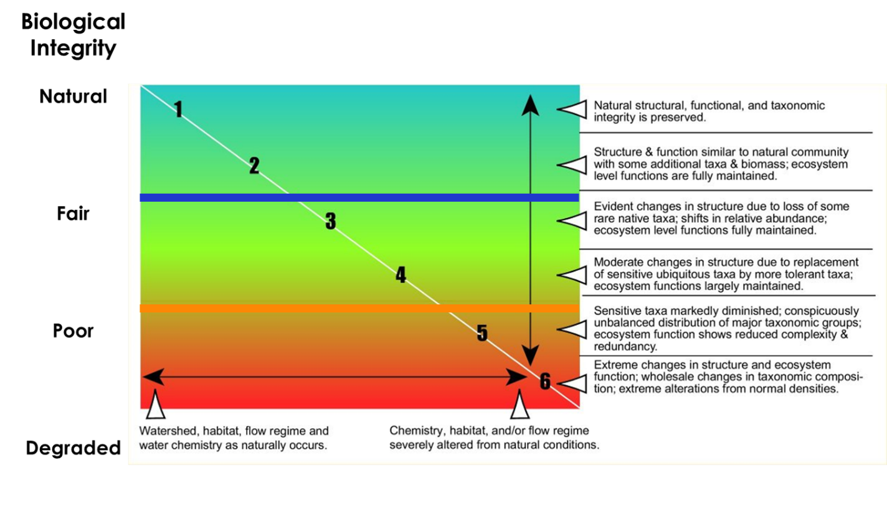

# Enhancing U.S. Clean Water Act Implementation for Continuing Success - A Framework to Inform High Quality Stream Protection Using the Biological Condition Gradient 

[**Proposal Presentation - Draft 2022-03-13**](https://marybecker.github.io/HQStreamEval/presentation/hq_stream_eval_proposal.html)

## I. Introduction
Significant progress has been made to clean up rivers since the passage of the 1972 U.S. Federal Water Pollution and Control Act amendments, more commonly referred to as the Clean Water Act (CWA), fifty years ago. However, since that time much of the focus has been on restoring waste-receiving streams with overt pollution problems which has left high quality streams vulnerable and open to degradation (U.S. EPA 2012). High quality streams support aquatic species not found in streams with higher levels of pollution (Bellucci et al 2011) along with a wide array of critical ecosystem services that benefit the social and economic well-being of humans (EPA 2012).   Despite restoration efforts, studies around the U.S. have noted that aquatic ecosystems are continuing to decline and pollutants levels are increasing in pristine streams (U.S. EPA 2012, Hudy et al. 2011, Stoddard et al. 2016).  Preliminary work conducted in Connecticut suggests the possible reduction of species sensitive to pollution in some high-quality streams sampling sites monitored over the past 30 years (Eltz & Beauchene 2020, Becker 2021, Becker & Bellucci 2021).

The Section 101(a) objective of the CWA is “…to restore and maintain the chemical, physical and biological integrity of the Nation’s waters.”  The Committee Report in support of the 1972 amendments clarified that the term integrity “…refers to a condition in which the natural structure and function of ecosystems is maintained,” rather than purely focusing on the restoration of impaired waters.   This project will seek to develop and effectively communicate modernized landscape level assessment methods that continue to augment the success of the CWA by including a focus on conservation and protection of rivers and streams.  This will be accomplished by incorporating the concept of the biological condition gradient.  A demonstration of this method will be applied in the State of Connecticut.

The Biological Condition Gradient (BCG) is a scientific framework to uniformly and directly interpret biological responses to anthropogenic stress (Davies & Jackson, 2006).  Biological integrity is the ability of an aquatic ecosystem to support and maintain a balanced, adaptive community of organisms having a species composition, diversity, and functional organization comparable to that of natural habitats within a region. The presence, condition, numbers and types of fish, insects, algae, plants, and other organisms provide direct, accurate information about the health of water bodies. Biological assessments measure these factors and are the primary tool used to evaluate the condition of water bodies. Because biological communities are affected by all of the stressors to which they are exposed over time, bioassessments provide information on disturbances not always revealed by water chemistry or other measurements.

The BCG framework provides a way to designate refined aquatic life uses along a gradient of stress.  This allows for a more precise measure of biological condition rather than a ‘pass’/’fail’ system that has been previously used for biological assessments (ref - CALM).  The BCG is a universal measurement system that is calibrated on a common scale for all states and regions.  There are 6 levels of biological condition described by the framework (Figure 1).  The levels are described in terms of changes in the structure and function of native aquatic communities. The levels range from a natural pristine condition with little anthropogenic stress (Level 1) to a severely stressed and altered condition that exhibits extreme changes in structure and ecosystem function (Level 6).  

*Figure 1. Biological Condition Gradient Conceptual Model*

Using existing biological and land cover datasets I will develop methods to identify high quality streams using the BCG. This includes first using biological datasets to identify waters that support sensitive species typically found in areas that are least disturbed by human activity. Next, I will calculate and identify the landscape features in the drainage basins and catchments that contribute to high quality biological samples. Finally, I will develop a model using these landscape characteristics to predict the likelihood of stream catchments where samples have not been collected. I will use these predictions to identify those high-quality streams that are most vulnerable to degradation if human disturbance is increased in those catchments.

This information could be used by aquatic resource managers, decision makers and the public to prioritize preservation efforts, as well as support management to prevent further degradation in these streams and implement anti-degradation measures under the Clean Water Act.   An interactive web-mapping application will be developed to convey this data on high quality streams and drainage systems to decision makers. The application would allow for a simplified high-level overview of statewide conditions, while still allowing the user to dig deeper into the site and watershed scale data through leveled zoom and click functions with popup information. The application will display the likelihood of a stream catchment supporting high quality waters. A slider will be used to change the predictions on the map if human disturbance is increased in a particular catchment. This will allow for a 'what if' analysis that identifies those catchments that are most vulnerable to small increases in disturbance.

## II. Methodology
### A. Data and general modeling approach

**General Modeling Approach**

To develop models that make stream-specific predictions about the likelihood that a stream is of high quality across Connecticut, I will use macro-invertebrate and fish biological data sets collected over the past 30 years by the CT DEEP Monitoring and Assessment Program, as well as, the Inland Fisheries Program.  I will also use a high resolution National Hydrography flowline and catchment data set that was developed by the [USGS Conte Lab]( http://conte-ecology.github.io/shedsGisData/) and cleaned for Connecticut. This data set is based on a network of stream segments.  The stream network will be used to calculate drainage basin land cover statistics using a [custom script in R](https://github.com/marybecker/HQStreamEval/blob/main/analysis/accum_attributes_V2.R).  

The model will be developed in several steps: 
1.	Create training and validation data sets of BCG observations and identify minimally disturbed streams with high biological integrity (BCG Tiers 1 or 2)
2.	Characterize temporally and spatially specific drainage basin environments for each biological sample that includes corresponding land cover conditions for the nearest time period of sampling using the UCONN CLEAR and CT DEEP 30 M resolution land cover data sets that describe natural and human disturbance conditions.
3.	Relate observed BCG to environmental predictors using a machine learning technique (e.g. random forests, boosted regression).
4.	Assess model performance and validate using multiple observations made at randomly chosen stream segments.

**Biological Data Sets and Biological Condition Gradient Metric Calculations**

Fish samples were collected by the CT DEEP Inland Fisheries and Ambient Monitoring and Assessment program using comparable methods during a May - October index period from 1988 – 2020 (Hagstrom et al. 1995, CT DEEP 2013). Crews sampled 10-20 mean stream widths with the average sample width being approximately 118 meters. Reach widths used in this dataset ranged from 25 to 500 meters. The type of gear that a crew used depended on the stream width. In small streams, crews typically sample with one backpack shocker. In medium-sized streams, they used 2 backpack shockers or 1 tote barge, and in large streams, crews sampled with multi-tote barges. All captured individuals were measured to the nearest centimeter and are identified to the species level. 
Benthic macroinvertebrate samples were collected by the CT DEEP Ambient Monitoring and Assessment program from September through November using an 800-u m-mesh kick net from 1989 - 2020. A total of 2 meters squared of riffle habitat (12 kicks composited from multiple riffles of a stream reach) were sampled at each location. Samples were preserved in 70% ethyl alcohol and brought back to the laboratory for subsampling. A 200-organism subsample was taken using a random grid design (Plafkin et al. 1989) from each sampling location. Organisms were identified to the lowest practical taxon, generally species.

Biological condition gradient models have been developed for both macro-invertebrate and fish communities in Connecticut (Gerritsen & Jessup 2007, Stamp & Gerritsen 2013).  The models incorporate multiple attribute decision criteria to assign stream to levels or tiers of the BCG and it can be directly applied to designation of multiple aquatic life uses in Connecticut’s water quality criteria and standards.  The models were run using the [BioMonTools](https://github.com/leppott/BioMonTools) and [BCGcalc](https://github.com/leppott/BCGcalc) packages written for the R statistical programming language (Leppo 2022a, Leppo 2022b).

**Characterization of temporally and spatially specific drainage basin conditions for biological samples**

I derived (x * number) of drainage basin predictors.  These predictors focused on characterizing the spatial variation in naturally occurring and human disturbance regimes across Connecticut streams. [Landcover datasets](https://clear.uconn.edu/projects/landscape/index.htm) developed by the University of Connecticut Center for Land Use and Education and Research (UCONN CLEAR) 7 different time periods (1985, 1990, 1995, 2002, 2006, 2010 and 2015) were used to derived percentages of land cover classes and forest fragmentation.  I first [developed a script](https://github.com/marybecker/HQStreamEval/blob/main/analysis/lc_catchment_stats.R) to reclassify each land cover category needed for the model and then extracted land cover classes for each NHD stream catchment. I then extracted the temporally and spatially specific observations for each of the land cover classes used that matched the closest time and location (NHD Stream Segment) of each biological observation.  In addition, I characterized geological and hydrological conditions, such as stratified drift, stream density, and upstream drainage basin area.

### B. Medium for delivery

The anticipated application is a web-based client-side mapping application primarily designed for typically desktop use with a 1280 X 1024 resolution, but will also be suitable for smaller screen resolutions.  Pre-computed model predictions will be served as json files.  A series of R and Python scripts will document reproducible workflows of data processing and model development.  The anticipated technology stack for the web-based application includes HTML/CSS/Javascript, [D3.js](https://d3js.org/) and [MapBox JS GL](https://docs.mapbox.com/mapbox-gl-js/api/) or [Leaflet JS](https://leafletjs.com/).
### C. Application layout

The anticipated application layout is a simple straight forward design with a small top title and info bar and then the map filling the majority of the space.

### D. Thematic representation
### E. User Interaction
### F. Aesthetics and design considerations

## III. Results
## IV. Discussion
## V. References / Anticipated References
[Ahearn, E.A., 2010, Regional regression equations to estimate flow-duration statistics at ungaged stream sites in
Connecticut: U.S. Geological Survey Scientific Investigations Report 2010–5052, 45 p](https://pubs.usgs.gov/sir/2010/5052/pdf/sir2010-5052_web.pdf)

[Bellucci, C.J., Becker, M., Beauchene, M. 2011. Characteristics of macroinvertebrate and fish communities from 30 least disturbed small streams in Connecticut. Northeastern Naturalist 18:411-444](https://portal.ct.gov/-/media/DEEP/water/water_quality_management/monitoringpubs/Bellucci-et-al-2011-Northeastern-Naturalist.pdf)

[Davies, S.P., and S.K. Jackson. 2006. The Biological Condition Gradient: A descriptive model for interpreting change in aquatic ecosystems. Ecological Applications 16:1251–1266.](https://doi.org/10.1890/1051-0761(2006)016[1251:TBCGAD]2.0.CO;2)

[Elith, J. and J.R. Leathwick.  2009.  Species Distribution Models:  Ecological Explanation and Prediction Across Space and Time.  Annual Reviews of Ecology, Evolution, and Systematics 60:677-697](https://doi.org/10.1146/annurev.ecolsys.110308.120159)

[Eltz, B., and M. Beauchene. 2020. A random revisit of the Statewide stream survey project: A focus on Wild Brook Trout. CT DEEP, Bureau of Natural Resources. Hartford, CT.](https://portal.ct.gov/-/media/DEEP/fishing/fisheries_management/Trout-Research-and-Management/Probabilistic-Sampling-of-Wild-Brook-Trout-Occurrence-in-Stream-Survey-Samples-Final-05082020.pdf)

[Gerritsen J, Jessup B. 2007. Calibration of the biological condition gradient for high gradient streams of Connecticut. Report prepared for US EPA Office of Science and Technology and the Connecticut Department of Environmental Protection. TetraTech, Maryland ](https://portal.ct.gov/-/media/DEEP/water/water_quality_management/monitoringpubs/Gerritsen-and-Jessup-2007-Calibration-of-the-BCG-for-High-Gradient-Streams-of-CT.pdf)

[Hill, R.A., Carlisle, D.M, Hawkins, C.P.  2013. Predicting thermal reference conditions in USA streams.  Freshwater Science 32(1): 39-55](https://www.journals.uchicago.edu/doi/10.1899/12-009.1)

[Leppo, E. 2022. BCGcalc. Washington, DC: GitHub; accessed 2022 February 19.]( https://github.com/leppott/BCGcalc)
[Leppo, E. 2022. BioMonTools. Washington, DC: GitHub; accessed 2022 February 19.]( https://github.com/leppott/BioMonTools)

[Lovelace, R., Nowosad, J., Muenchow J. 2019.  Geocomputation with R.  CFC Press](https://geocompr.robinlovelace.net/index.html)

[Olson, J.R. and Cormier, S.M. 2019.  Modeling spatial and temporal variation in natural background specific conductivity. Environmental Science and Technology.](https://dx.doi.org/10.1021/acs.est.8b06777)

[Stoddard J.L., Van Sickle J., Herlihy A.T., Brahney J., Paulsen S., Peck D. V., et al. 2016. Continental-Scale Increase in Lake and Stream Phosphorus: Are Oligotrophic Systems Disappearing in the United States? Environmental Science and Technology 50, 3409–3415. ](https://pubs.acs.org/doi/abs/10.1021/acs.est.5b05950)

[Stoddard, J. L., Larsen, D. P., Hawkins, C. P., Johnson, R. K., Norris, R. H., 2006. Setting expectations for the ecological condition of streams: the concept of reference condition. Ecol. Appl. 2006, 16 (4), 1267−1276](https://doi.org/10.1890/1051-0761(2006)016[1267:SEFTEC]2.0.CO;2)

[U.S. Environmental Protection Agency (EPA). 2016. A Practitioner’s Guide to the Biological Condition Gradient:A Framework to Describe Incremental Change in Aquatic Ecosystems. EPA-842-R-16-001. U.S.Environmental Protection Agency, Washington, DC. ](https://www.epa.gov/sites/default/files/2016-02/documents/bcg-practioners-guide-report.pdf)

[U.S. Environmental Protection Agency (EPA). 2012. The Economic Benefits of Protecting Healthy Watersheds Fact Sheet.  EPA 841-N-12-004. Office of Wetlands, Oceans, and Watersheds. Washington, D.C.](https://www.epa.gov/sites/default/files/2015-10/documents/economic_benefits_factsheet3.pdf)

[U.S. Environmental Protection Agency (EPA). 2012.  Identifying and Protecting Healthy Watersheds:  Concepts, Assessments, and Management Approaches.  EPA 841-B-11-002. Office of Wetlands, Oceans, and Watersheds. Washington, D.C.](https://www.epa.gov/sites/default/files/2015-10/documents/hwi-watersheds-complete.pdf)

