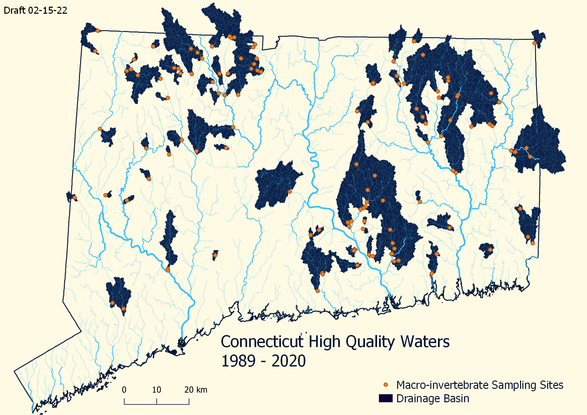

```{r setup, include=FALSE}
knitr::opts_chunk$set(message=FALSE, warning=FALSE)
```

## Overview

Biological integrity is the ability of an aquatic ecosystem to support and maintain a balanced, adaptive community of organisms having a species composition, diversity, and functional organization comparable to that of natural habitats within a region. The presence, condition, numbers and types of fish, insects, algae, plants, and other organisms provide direct, accurate information about the health of water bodies. Biological assessments measure these factors and are the primary tool used to evaluate the condition of water bodies. Because biological communities are affected by all of the stressors to which they are exposed over time, bioassessments provide information on disturbances not always revealed by water chemistry or other measurements.

The Connecticut Department of Energy and Environmental Protection (CT DEEP) samples several aquatic biological communities, including benthic macroinvertebrates.   Benthic macroinvertebrates are animals without backbones, who inhabit the bottom of rivers and streams, as well as many other waterbody types. These organisms are very well studied and have a long history of use as indicators of water quality. Certain types, including mayflies, stoneflies, and caddisflies, can survive only in the cleanest water quality conditions. Other major groups of macroinvertebrates are true flies, beetles, worms, crustaceans, and dragonflies. Tolerant species are those that can live in highly polluted waters, moderate species can endure a moderate level of pollution, while sensitive species only occur in waters with little to no pollution. Macroinvertebrate community data is interpreted into metrics that describe the biological condition of the stream.

The Biological Condition Gradient (BCG) is a scientific framework used by Connecticut to interpret biological responses to anthropogenic stress (Davies & Jackson, 2006) (Figure 1).  The BCG framework provides a way to designate refined aquatic life uses along a gradient of stress.  This allows for a more precise measure of biological condition than a ‘pass’/’fail’ system that has been used in the past (ref).  There are 6 levels of biological condition described by the framework which range from a natural pristine condition with little anthropogenic stress (Level 1) to a severely altered condition that exhibits extreme changes in structure and ecosystem function.  The BCG is calibrated and applied to benthic macroinvertbrate data from Connecticut high gradient streams.


## Methodology

Macroinvertebrate samples identified as a BCG 1 or 2 were considered high quality streams.
Upstream watershed drainage catchments and flow were identified using Catchments and Flowline derived from the National Hydrography Dataset. Upstream BCG2 drainages preprocessed in QGIS 3.4 using the [Flow Trace Tool](https://github.com/boesiii/flowtrace) 

## Results




